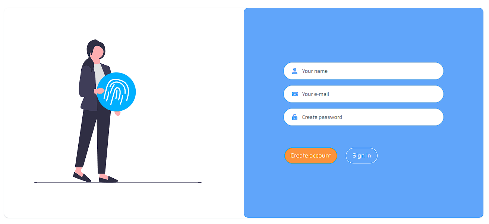

<h1 align="left"> Tela de Login </h1>

Tela de Login Responsiva que fiz do zero usando apenas HTML, Tailwindcss e JavaScript.



---

## 🚀 Como visualizar

Execute este comando no seu terminal:

```
git clone https://github.com/pedrogbraz/tela-de-login
```

Mover para o diretório

```
cd ./tela-de-login-main
```

Instale o projeto com

```
npm install
```

E, finalmente, execute o comando:

```
npm run dev
```

O projeto será localizado em: `http://localhost:3000`

---

## 🚀 Tecnologias Usadas

- HTML
- Tailwind css
- Javascript
- Git e Github

O projeto foi feito no Visual Studio Code.
